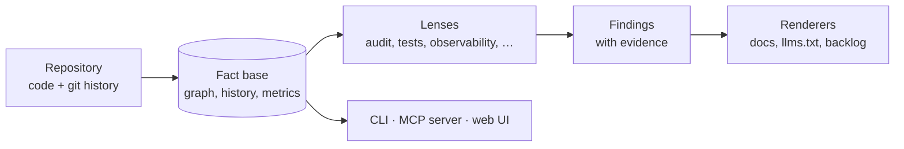

# RepoRanger

**A fact base and lenses for any codebase.**

> [!NOTE]
> **Design phase.** This repository contains documentation only; there is no code yet. Start with the [vision](docs/vision.md) or the [Module 1 MVP brief](docs/modules/01-ingest-and-index/mvp-brief.md).

RepoRanger will index a repository into a provenance-backed graph at zero LLM cost, then apply lenses that generate developer and business documentation, security and performance audits, bug and enhancement reports, test-coverage plans, observability recommendations, and an implementation backlog. You'll be able to use it from a CLI, an MCP server, or a web UI, with your own model keys.

## Why

Large repositories don't fit in a context window, and whole-repo LLM runs are slow, expensive, and hard to verify. Existing open-source tools each cover one slice, such as wikis, security scanners, PR reviewers, or code indexers. None of them produce business docs, observability recommendations, or a backlog from their findings.

RepoRanger does the heavy lifting once, deterministically: it parses the code, builds the graph, reads the git history, and records where every fact came from. Models see only small, token-budgeted context packs, and only when a lens needs them.

## What it will produce

| Capability | Feature group |
| --- | --- |
| Developer, business, and LLM-friendly documentation | Documentation |
| Security, performance, and quality audits; bug reports with evidence | Audit & Findings |
| Enhancement documents and major or minor improvement suggestions | Enhancement Recommendations |
| Test gap analysis and test plans | Test Quality |
| Logging and observability recommendations: KPIs, alerts, dashboards | Observability & Logging |
| A prioritized, traceable implementation backlog | Backlog & Delivery |

All of these build on **Ingest & Index** (the fact base) and the shared **Platform** layer. See [feature groups](docs/feature-groups.md).

## How it works

```mermaid
flowchart LR
  repo["Repository<br/>code + git history"] --> fb[("Fact base<br/>graph, history, metrics")]
  fb --> lenses["Lenses<br/>audit, tests, observability, …"]
  lenses --> findings["Findings<br/>with evidence"]
  findings --> out["Renderers<br/>docs, llms.txt, backlog"]
  fb --> access["CLI · MCP server · web UI"]
```

## Principles

- **Zero-LLM-cost indexing.** Model spend is lazy, cached, and metered.
- **Evidence on everything:** file, line range, and commit.
- **Bring your own key**, with models chosen per role.
- **One portable index file per repository**, behind stack-neutral contracts.
- **MIT-licensed.**

## Roadmap

First up is the Module 1 MVP: index a ~1M LOC polyglot repository (C#, TypeScript/JavaScript, and Python) on a laptop with zero LLM spend, and expose it through a CLI and an MCP server. See the [roadmap](docs/roadmap.md).

## Documentation

Everything is under [docs/](docs/README.md): vision, feature groups, roadmap, decision records, the Module 1 brief, and the landscape research.

## Contributing

Design feedback is welcome now; see [CONTRIBUTING.md](CONTRIBUTING.md).

## License

[MIT](LICENSE)
