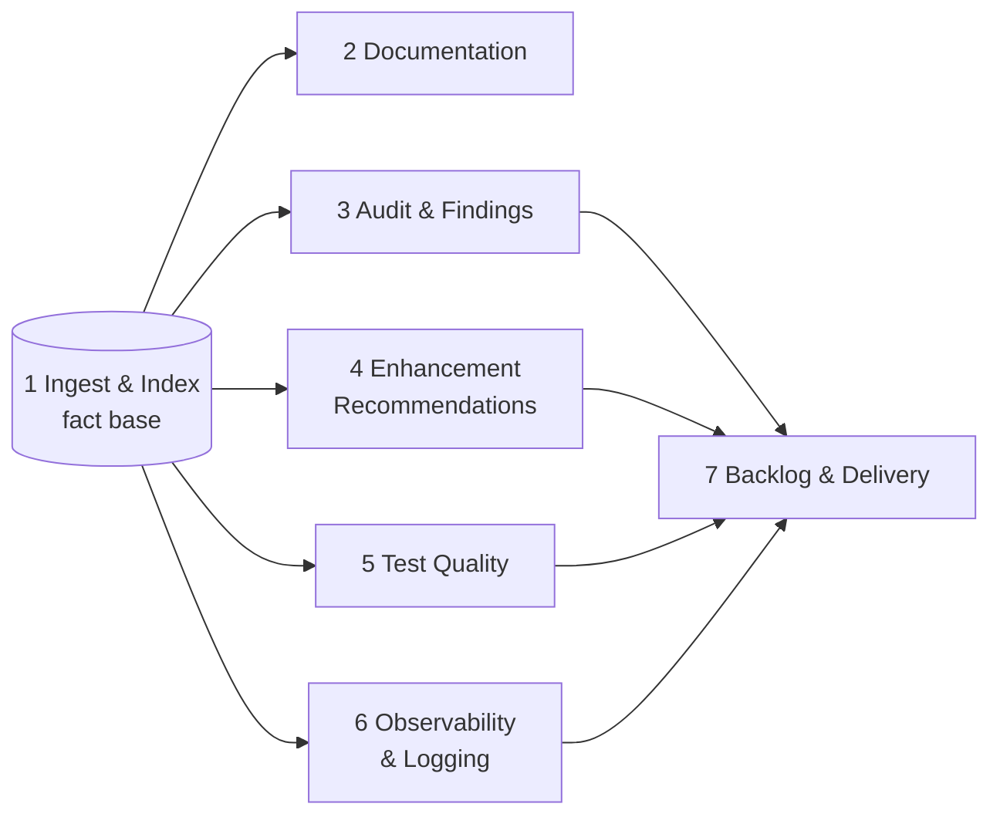

# Feature groups

**Status:** The eight groups were confirmed on 2026-09-19. Only Module 1 is designed; the other sections hold the ideas captured so far. · **Last updated:** 2026-09-19

RepoRanger is organized into eight feature groups, called modules. Module 1 builds the fact base, Modules 2–7 are lenses and renderers over it, and Module 8 is the platform they share.

Every module reads from the fact base; the finding-producing modules feed the backlog. Module 8 (Platform) supports all of them.

| # | Module | Capabilities | Produces | Status |
| --- | --- | --- | --- | --- |
| 1 | Ingest & Index | Foundation | The fact base, plus CLI and MCP queries | [MVP brief](modules/01-ingest-and-index/mvp-brief.md) drafted |
| 2 | Documentation | 1, 2, 3 | Developer, business, and LLM-friendly docs | Next to design |
| 3 | Audit & Findings | 4, 5 | Audits and bug reports with evidence and severity | Not designed |
| 4 | Enhancement Recommendations | 6, 7 | Guideline, best-practice, refactoring, and improvement proposals | Not designed |
| 5 | Test Quality | 8 | Test gap analysis and test plans | Not designed |
| 6 | Observability & Logging | 9 | Observability recommendations: KPIs, indicators, alerts, dashboards | Not designed |
| 7 | Backlog & Delivery | 10 | Prioritized, estimated, traceable work items | Not designed |
| 8 | Platform | Cross-cutting | Findings store, lens runner, cost controls, UI | Not designed |

Capability numbers refer to the list in the [vision](vision.md#what-reporanger-will-produce).

## 1. Ingest & Index

Clone or sync repositories; precise code structure imported from SCIP indexes, with a light tree-sitter fallback; the symbol, call, and dependency graph with a resolution level on every edge; file-level git history and its signals; repository artifacts; community detection; full-text search; incremental re-indexing with a staleness check; and an MCP server over the index. Lazy summaries follow in P1. This is the foundation for everything else, kept deliberately thin ([ADR 0011](decisions/0011-scip-first-extraction.md)).

- [MVP brief](modules/01-ingest-and-index/mvp-brief.md): scope, P0 features, acceptance criteria, confirmed decisions.
- [Feature catalog](modules/01-ingest-and-index/feature-catalog.md): every Module 1 capability and idea, with its phase.

## 2. Documentation

Developer docs (architecture, modules, APIs, diagrams), business docs (features, user journeys, glossary, compliance), and LLM-friendly docs (llms.txt, AGENTS.md or CLAUDE.md, repo packs).

Ideas captured so far:

- **Markdown layer:** generated docs as markdown with frontmatter, in git, with the index as a rebuildable cache ([ADR 0006](decisions/0006-markdown-for-humans-db-as-cache.md)).
- **Existing docs as input:** README files, ADRs, and wiki pages linked to the code they describe. Module 1 already ingests README files and ADRs.
- **Edit-preserving regeneration:** merge human edits instead of overwriting them.
- **Freshness and drift score** per module: how far the code has moved since the last doc pass.
- **Retroactive ADRs** from history (decision archaeology, Module 1 P1).
- **Glossary seed** from domain vocabulary mining (Module 1 idea #18).
- **Candidate components:** CodeWiki for developer docs and Repomix for LLM packs ([research](research/oss-landscape-2026-09.md)).

Open question: where generated markdown lives, in a tool-owned folder in the repository (working name `.reporanger/`) or in a separate docs repository.

## 3. Audit & Findings

Security, performance, and quality audits; dependency, SBOM, and license audits; config, IaC, and secrets review; and bug reports with evidence and severity.

Ideas captured so far:

- **Deterministic scanners first** (for example Semgrep CE, language analyzers, Syft and OSV-Scanner), then LLM triage.
- **Adversarial validation:** a second, independent model tries to falsify every finding before it is reported (Platform).
- **History-aware priority:** rank by where bugs historically cluster, using Module 1 history signals.
- **Data-flow and PII mapping:** where personal data enters, is stored, is logged, or leaves; this feeds both security and compliance docs.
- **API surface and breaking-change detection** across versions, built on snapshot diff (Module 1 P1). Proposed placement.
- **Inputs from the Module 1 P1 inventories:** authorization surface, configuration surface, error handling, and data model.

## 4. Enhancement Recommendations

Coding guidelines for the tech stack, best practices, refactoring, hotspot-driven major and minor proposals, and architecture drift.

Ideas captured so far:

- **Hotspot analysis** (churn × complexity × low coverage) to rank where refactoring pays off.
- **Architecture recovery:** infer the intended layers and boundaries, and flag violations.
- **Change coupling** to expose hidden dependencies worth refactoring.
- **Dead-code and clone candidates** (Module 1 ideas #16 and #17).

## 5. Test Quality

Test-to-code mapping, coverage gaps, suggestions for missing or weak tests, mutation-testing input, and a plan to start testing where no tests exist.

Ideas captured so far:

- **Rank gaps by risk:** churn and hotspots first, not raw coverage percentage.
- **Mutation testing** (for example Stryker or Stryker.NET) to judge suite quality.
- **Coverage of risk over test count:** research found that the volume of generated tests doesn't predict outcomes.
- **Test generation last, if at all:** it had the weakest return in the research.

## 6. Observability & Logging

A log quality review, tracing and correlation gaps, and recommendations for KPIs, indicators, alerts, and dashboards. The output is a recommendations document, not an implementation.

Ideas captured so far:

- **Built on Module 1 P1 inventories:** logging and telemetry sites (#8), system interfaces as "what to monitor" (#5), and error handling (#9).
- **Differentiator:** no open-source tool does this today.

## 7. Backlog & Delivery

Findings become prioritized, estimated, dependency-ordered work items, traceable to the exact lines, with export to Azure DevOps and Jira.

Ideas captured so far:

- **Human-in-the-loop gate:** a reviewer accepts or rejects findings before they become backlog items.
- **History-based effort estimates**, and routing to owners through the contributor expertise map.
- **Dependency ordering** from the code graph.
- **Patterns to borrow:** Kodus's finding-to-issue lifecycle; the Azure DevOps MCP Server and Jira APIs for write-back.
- **Differentiator:** no open-source tool turns findings into a backlog today.

## 8. Platform

Cross-cutting services: the findings schema and lifecycle, tiered models and token budgets, adversarial validation, a cost dashboard, an eval harness, cross-repo views, "ask the repo" chat, and the UI.

Ideas captured so far:

- **Findings store:** a SARIF-style schema (location, evidence, severity, confidence, category) with content-hash IDs, so re-runs update findings instead of duplicating them. Supports dedupe, suppress, accept-risk, and trends over time.
- **Lens runner:** tiered models (cheap triage, frontier synthesis), per-lens token budgets, and adversarial second-model validation.
- **Full-repo and diff modes:** diff mode is what makes continuous runs affordable.
- **Eval harness:** a small labeled set of known bugs to measure precision and recall, so a prompt change that regresses gets caught.
- **Cost dashboard:** token cost per run and per lens.
- **Cross-repo mode:** shared dependencies, duplicated logic, and service-to-service call maps across many repositories.
- **"Ask the repo" chat** over the same index; semantic search arrives in Module 1 P2.
- **Web UI** (views over findings) and an **admin UI** for model roles (P2).
