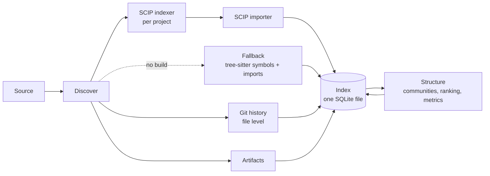

# Module 1 — Ingest & Index: design notes (draft)

**Status:** Draft, not approved; revised after the review of 2026-09-19 · **Last updated:** 2026-09-19

> [!IMPORTANT]
> These notes capture the technical sketch behind the [MVP brief](mvp-brief.md). They are input for milestone M0, where the index schema, MCP tool contracts, plugin interface, and sensitivity rules become specs. Nothing here is decided, and everything must stay stack-neutral.

## Pipeline

> [!NOTE]
> The [plugin interface](../../specs/plugin-interface.md) supersedes this sketch for extraction. A syntax pass runs on every code file ([ADR 0013](../../decisions/0013-syntax-pass-on-every-code-file.md)), SCIP adds resolution, and syntax extractors, SCIP indexers, and manifest extractors follow the plugin interface.

Every stage writes into the index. Structure runs over the stored graph and writes its results back. P0 has no LLM stage; summaries join the pipeline in P1.

| Stage | What it does | Phase |
| --- | --- | --- |
| Source | Local path or a clone from any git URL; the registry records URL, default branch, and last indexed commit | P0 |
| Discover | Gitignore-aware walk, language and project detection, exclusion of generated, vendored, and minified files, size caps. Emits a file manifest with content hashes and the list of projects with their indexer | P0 |
| SCIP indexer | Runs scip-dotnet, scip-typescript, or scip-python per project (or ingests a pre-built `index.scip`); produces compiler-resolved definitions, references, and relationships | P0 |
| SCIP importer | Maps SCIP documents, symbols, occurrences, and relationships onto RepoRanger nodes and edges with provenance and resolution level `resolved` | P0 |
| Fallback | For projects the indexer can't build: tree-sitter symbols and imports only; edges are `import-scoped` or `name-match`; the health report lists the project | P0 |
| Git history | Commit graph, file–commit links, per-file churn (recency-weighted), age, change coupling, bug-fix commits | P0 |
| Artifacts | Dependency manifests and lockfiles, test-to-code mapping; coverage, SARIF, IaC, and document nodes in P1 | P0 / P1 |
| Structure | Community detection over the call and import graph; PageRank-style importance; entry points; complexity metrics; hotspot score | P0 |
| Summaries | Symbol → file → community → repo, on demand, cached with input hash, model, and prompt version | P1 |

## Conceptual graph model

> [!NOTE]
> The [index schema](../../specs/index-schema.sql) supersedes this sketch. Commits and tests aren't separate node kinds there, TOUCHED_BY is dropped, and symbol IDs follow [ADR 0014](../../decisions/0014-symbol-id-scheme.md).

**Node kinds**

| Kind | Represents |
| --- | --- |
| Repo | A registered repository |
| Project | A buildable unit inside the repo (solution or project, package, Python package), with its indexer and extraction status |
| File | A source or artifact file |
| Symbol | A type, function, method, interface, or constant |
| Community | A detected code module |
| Package | A dependency, with version |
| Test | A test case or suite |
| Commit | A commit, with author, date, parents, and references (P0 links commits to files; symbols in P1) |
| Endpoint, Config, Document, Summary | Reserved for P1 |
| Finding | Reserved for later modules |

**Edge kinds:** `CONTAINS`, `IMPORTS`, `CALLS`, `REFERENCES`, `INHERITS`, `IMPLEMENTS`, `TESTS`, `DEPENDS_ON`, `CO_CHANGES` (from git), `TOUCHED_BY` (file → commit); `EXPOSES` and `SUMMARIZES` from P1.

Every node carries a content hash, the last commit it was seen in, and provenance (file, line range, commit). Every edge carries a type, a weight, provenance, and a **resolution level**:

| Level | Meaning | Source |
| --- | --- | --- |
| `resolved` | The compiler resolved the target | SCIP importer |
| `import-scoped` | The target name is unique within the files the source imports | Fallback |
| `name-match` | The target is a repo-wide name match; treat as a guess | Fallback |

**Symbol IDs** are stable across re-indexing: `path::kind::name#signature-hash`, for example `src/Auth/Login.cs::Method::Login#a1b2c3`. SCIP symbol strings are stored alongside for round-tripping. An ID changes when a symbol moves, is renamed, or changes its signature, and stays the same for unrelated edits.

## Embedded storage layout (SQLite)

> [!NOTE]
> Superseded by the [index schema](../../specs/index-schema.sql).

| Table | Holds |
| --- | --- |
| `meta` | `schema_version`, index hash, indexed commit, configuration hash, timestamps |
| `nodes` | id, kind, name, language, path, line range, content hash, commit, and a JSON column for kind-specific attributes (signature, metrics, importance score, community id, extraction status) |
| `edges` | from id, to id, type, weight, resolution level, provenance |
| `fts` | Full-text index over symbol names, doc comments, and file text |
| `commits`, `file_commits` | The commit graph and file–commit links; churn, age, and coupling are stored as node attributes and edge weights |
| `summaries` | node id, level, text, input hash, model, prompt version (P1) |
| `vectors` | Embeddings (P2) |

How queries run:

- 1–3 hop queries (`get_neighbors`, `get_dependencies`, `get_tests_for`) are indexed joins on `edges`.
- `get_impact` is a recursive query with a depth cap; the tool exposes the cap and the maximum a caller may request, both set in M0.
- Graph algorithms don't run in the database. At index time the edge list is loaded into memory, the algorithm runs, and the results are written back as node attributes.
- A `schema_version` mismatch triggers a re-index in the MVP; migrations come later.

## Incremental re-indexing and freshness

> [!NOTE]
> The freshness rules and the refresh bound are now specified in [mcp-meta.json](../../specs/mcp-meta.json) (`conventions.freshness` and `limits.refresh`).

- A Merkle tree over the file manifest finds what changed.
- Only changed files are re-extracted. For SCIP projects the indexer re-runs per project; the importer replaces only the documents whose hash changed. Edges are recomputed for changed files and their direct neighbors.
- Writes are committed per batch, so an interrupted run resumes by rerunning: files already indexed at the same content hash are skipped.
- Community detection re-runs only when the edge set changes beyond a threshold; new commits extend the stored history.
- **Staleness check on every MCP call:** compare `HEAD` and the manifest hashes with the index; if the difference is within the configured bound (a number of files and a time budget, set in M0), refresh before answering; otherwise answer from the index and set `stale` in `_meta`.
- Every response carries `_meta`: `indexed_commit`, `index_age`, `stale`, `schema_version`.

## MCP surface (v1)

> [!NOTE]
> Superseded by the MCP contracts: [mcp-meta.json](../../specs/mcp-meta.json), the tools in [mcp-tools/](../../specs/mcp-tools/), and [mcp-usage.md](../../specs/mcp-usage.md).

Terse outputs, provenance and `_meta` on every response. Every list tool accepts many targets, paginates with `limit`/`cursor`, and expands with `include` flags. The same handlers back the CLI and, later, the UI.

| Tool | Returns |
| --- | --- |
| `index_repo` | Starts or resumes indexing of a registered repo; reports progress |
| `get_index_info` | Indexed commit, index hash, schema version, node and edge counts, health summary (parse failures, unresolved symbols, skipped files, fallback projects), staleness |
| `repo_map` | Structural overview: communities with sizes and top symbols by importance, entry points, languages, packages |
| `get_module` | One community or file: members, entry points, dependencies in and out, hotspots, coupling partners |
| `find_symbols` | Symbols matching a name, kind, language, or path filter |
| `get_symbol` | Signature, doc comment, location, snippet, metrics |
| `get_neighbors` | Direct callers, callees, or references of symbols (`direction`) |
| `get_impact` | Transitive callers or dependents up to a depth cap (`symbol`, `depth`, `direction`) |
| `get_dependencies` | Package and module dependencies |
| `get_tests_for` | Tests mapped to symbols or files |
| `get_hotspots` | Ranked hotspots with their churn and complexity components |
| `get_history` | Commits touching files or modules: message, author, date, PR and issue references |
| `search` | Ranked full-text results with filters |
| `pack_context` | A token-budgeted, deterministic bundle of symbols, neighbors, and evidence for a question or a set of symbols |

**Resources:** `reporanger://repo/{name}/map` (the repo map) and `reporanger://repo/{name}/index` (index info). **Prompt:** a short usage guide: which tool answers which question, the depth caps, and how to batch.

## Sensitivity policy

> [!NOTE]
> Superseded by the [sensitivity rules](../../specs/sensitivity-rules.md).

- **File-name rules:** `.env*`, key and certificate files, credential stores, and configurable globs.
- **Secret-pattern rules:** known credential formats (API keys, tokens, private keys), in the style of Secretlint or gitleaks.
- Matching files are indexed for structure (so the graph stays complete) but their content never appears in `get_symbol`, `search`, `pack_context`, or `get_history` diffs; a redaction note appears instead.
- The same rules gate every LLM call from P1 on.

## Golden sample and fixture

A small fixture repository lives in this repository: one C#, one TypeScript, and one Python project with known symbol and edge counts, plus one project that deliberately doesn't build. A hand-checked sample of 30 call edges per language is the accuracy oracle. The CI job indexes the fixture and fails when counts or precision regress; the same sample runs against the demo repos at release.

## Model roles (P1)

Lenses ask for a role, and configuration maps it to a provider and model ([ADR 0002](../../decisions/0002-byok-and-model-roles.md)). P0 makes no LLM calls; the roles below apply from P1.

| Role | Use |
| --- | --- |
| `extract` | Symbol and file summaries: many, small, cheap |
| `triage` | Cheap classification and filtering of candidates (lens modules) |
| `synthesize` | Module and repo summaries; later, document synthesis |
| `verify` | An independent second model that tries to falsify findings |
| `embed` | Embeddings for semantic search (P2) |

## Technology candidates

The reference implementation is C#/.NET ([ADR 0010](../../decisions/0010-dotnet-reference-implementation.md)). The table keeps candidates for all three stacks because the contracts are stack-neutral and parity implementations may follow.

| Area | Candidates |
| --- | --- |
| Precise extraction | scip-dotnet, scip-typescript, scip-python (Apache-2.0); the SCIP protobuf schema is read with the platform's protobuf library |
| Fallback parsing | tree-sitter (official bindings for Node.js and Python; community bindings for .NET), symbols and imports only. Since [ADR 0015](../../decisions/0015-any-parser-that-passes-the-fixtures.md), any parser that passes the golden fixtures may serve a language, such as Roslyn's syntax trees for C# |
| Storage | SQLite with FTS5; sqlite-vec for vectors (P2); PostgreSQL with pgvector for the Server profile |
| Graph algorithms | Leiden or Louvain community detection; PageRank; implemented in-process for the reference stack |
| Secret detection | Secretlint or gitleaks rule sets, as data |
| MCP | Official MCP SDKs for C#, TypeScript, and Python |
| Model access (P1) | A per-stack client abstraction, e.g., Microsoft.Extensions.AI in .NET |
| Git access | e.g., LibGit2Sharp in .NET; other stacks have equivalents |

## Resolved on 2026-09-19

- **Extraction:** SCIP-first with a light tree-sitter fallback ([ADR 0011](../../decisions/0011-scip-first-extraction.md)).
- **Impact queries:** a dedicated `get_impact` tool; one-hop neighbors from `get_neighbors`.
- **Summaries:** P1, with `extract` for symbol and file summaries and `synthesize` for module and repo summaries.
- **Hotspots:** decayed churn × complexity, shipped in M3 with the history signals; the coverage factor returns in P1.
- **Freshness:** staleness check with bounded refresh on every MCP call, and `_meta` on every response.
- **Symbol IDs:** a syntax pass runs on every code file, and IDs are computed from it in both modes, so fallback and SCIP IDs match once a project starts building. See the [index schema](../../specs/index-schema.sql), [ADR 0013](../../decisions/0013-syntax-pass-on-every-code-file.md), and [ADR 0014](../../decisions/0014-symbol-id-scheme.md).
- **Impact depth and latency:** `get_impact` defaults to depth 3, with a maximum of 6. It returns ranked, capped results, with a p95 target of 300 ms on agent-framework ([mcp-meta.json](../../specs/mcp-meta.json)).
- **Refresh bound:** up to 20 changed files are refreshed within 2 seconds, at the syntax level, with SCIP re-resolution pending until the next index run ([mcp-meta.json](../../specs/mcp-meta.json)).
- **SCIP indexer invocation:** the [plugin interface](../../specs/plugin-interface.md#71-indexer-descriptors) defines the descriptor format. The concrete descriptors for scip-dotnet, scip-typescript, and scip-python go into the M1 and M3 task specs, after those milestones run them on the demo repositories.

## Still open for M0

- Leiden versus Louvain for the reference implementation, given library availability in .NET.
- **History cost:** with full history as the default, how long does file-level history take on agent-framework? M3 measures it, and the default is revisited if it is too slow.
